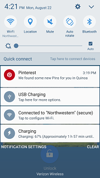
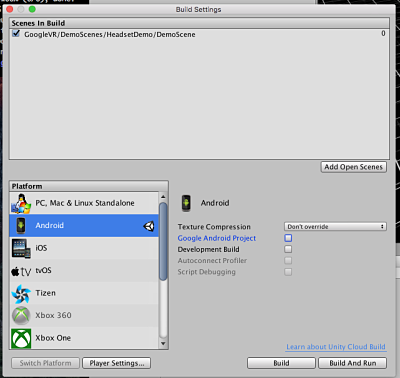
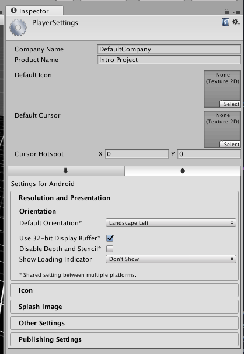
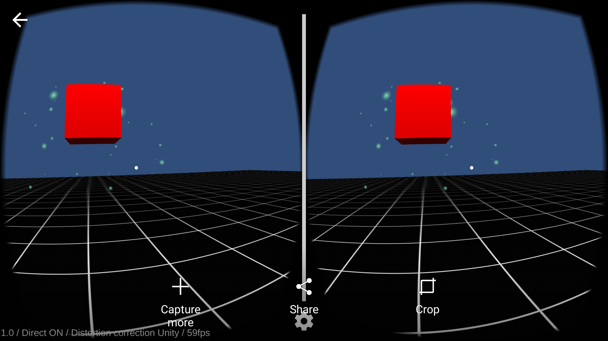

There are several ways to get started producing VR content. This tutorial outlines the process of using
the Unity game engine to deploy a Cardboard App to an Android phone.

# What is a game engine?
A game engine is a piece of software that provides patterns and abstractions that
make it faster and easier to create content. While they have the word "game" in the
name, game engines can be useful tools for creating anything from models of buildings
to 360 video projects. As of this writing, the two major game engines VR content
producers are using are [Unity](https://unity3d.com/) and [Unreal](https://www.unrealengine.com/what-is-unreal-engine-4). Both Unity and Unreal
are available to download for free. For the duration of this tutorial, we'll be focussing
on Unity.

#What does Unity get me?
Unity provides patterns and tooling to support your development process, but the
biggest benefit of using one of the big game engines is the community it provides.
There's a really robust library of tutorials (I recommend [Space Shooter](https://unity3d.com/learn/tutorials/projects/space-shooter-tutorial)), provided both by Unity and independent
developers, as well as a ton of assets, many of which are available for free, that
can be accessed through the Unity Asset Store. For the purpose of this tutorial, we're going to import assets from the Google VR SDK.

#Download the SDK
An SDK is a set of software development tools, typically provided by the maintainer of a platform or system, to make it easier for developers interact with that product. You can download Google's VR SDK, which we'll use to launch a Cardboard application, [here](https://developers.google.com/vr/concepts/overview-cardboard). In this tutorial, we'll simply play the demo scene, but there's a lot of fun stuff to play around with in their.

#Setup to deploy to an Android phone
The first thing you'll want to do is download [Android Studio](https://developer.android.com/studio/index.html) and follow the installation instructions. You'll need the path to the Android SDK later, so make sure you store it somewhere on your computer you find easy to access. If you're working on a Mac, you'll also need to make sure you have [Android File Transfer](https://www.android.com/filetransfer/).

Next, make sure your phone can receive USB transfers. This was a little trickier than I expected it to be.
With my phone plugged in, I pulled down the status bar so that my screen looked like this:

  

Then where it says "USB Charging", I tapped for more options and turned on data transfer.

You'll also need to make sure USB debugging is enabled. You can do this in Developer options. If Developer Options aren't listed in
your phone's setting's you'll need to activate them, which is a pretty silly process. Under Settings, go to Device Information, scroll down until you see the phone's "Build Number". Tap on the Build Number seven times and a message saying "You are now a developer" will appear. Now, when you search in Settings, Developer Options should be a result. In the debugging section of Developer Options, turn on USB debugging. Then, plug your phone into your computer.

#Configuring your build in Unity
With your project open in Unity, go to File > Build Settings and highlight Android in the Platform list. Then click "Switch Platform".

Now, click on the Player Settings button which will reveal the PlayerSettings section of the Unity Inspector. There are three things you'll need to change here:

* Under "Other Settings", name your project by entering a package name in the "Bundle Identifier" field
* You'll also need to set the Minimum API level to "Android 4.4 KitKat". You'll find a dropdown for this also under "Other Settings"
* Finally, under "Resolution and Presentation", you'll want to make sure the default orientation is "Landscape Left".

Now, hit "Build and Run". Did it work?! If not, don't panic, 90% of the time, Unity is just having trouble finding the Android SDK. You can tell it where it is by going to Unity>Preferences>External Tools. Then go back to the build window and hit Build and Run again. If a shortcut with the Unity symbol on it is added to your phone and you're running something that looks like this, then you're in business:

