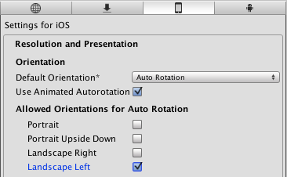
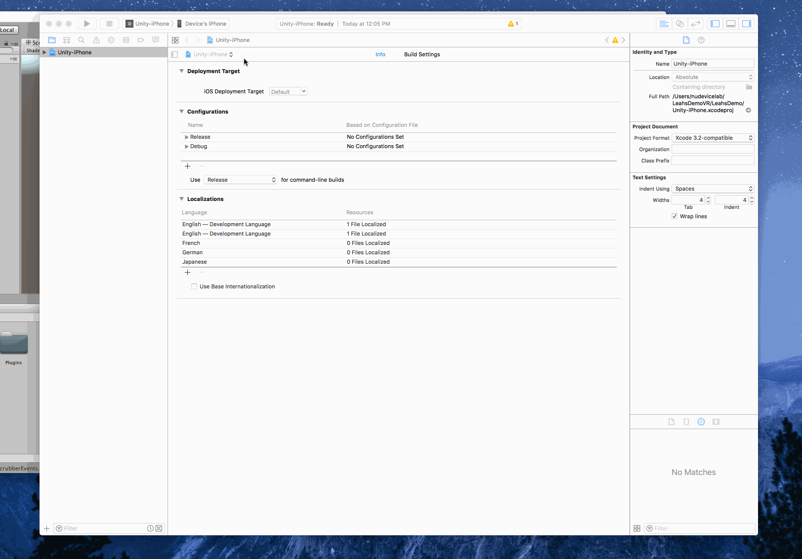

The goal of this demo is to transfer a build from Unity onto an iOS mobile phone. We will essentially be packing a suitcase in Unity and then unpacking it onto your phone. 

You will need to have downloaded Xcode and Unity to your computer. You can download Xcode for free on the Mac App Store. Information about what you're downloading can be found [here](getting-started/game-engine.md) under the Android explanation. 

#Download Unity
You can download the latest version of Unity [here](https://developers.google.com/vr/unity/get-started-ios)
Scroll down to “Set up the Google VR Unity SDK" and click on the “Download and Install the latest version of Unity” link. Download and create a Unity account. 

#Download the SDK
Download the Google VR SDK for Unity. You can download the repo directly. Create a new project in Unity, I called mine DemoVR, and make sure it is on the 3D setting. 

#Setup to deploy to iPhone
Once in Unity, go to Assets -> Import package -> Custom package and locate the Unity package you downloaded on your computer. Import everything. 

Next, go to File -> Build Settings. Click on iOS under platform and then click to switch the platform. If it doesn’t let you click , then click on open download page and download. You should now be able to switch platforms. Then click Player Settings. 

A panel should appear on the right hand side of the Unity home screen. Click on the tab at the top right of the Unity screen that says “Inspector.” 

Find Settings for iOS and click on Resolution and Presentation.Set the Default Orientation to Auto Rotation and then uncheck everything under Allowed Orientations for Auto Rotation except Landscape Left. 

Then, plug in your iOS device via USB and click Build and Run under the Build Settings window. (If you closed your Build Settings window, you can reopen it with File -> Build Settings.I saved mine as DemoVR. 

When it successfully complies, Xcode will open. (Don’t worry if Unity quits unexpectedly, it'll do that sometimes; just reopen your project). 

When in Xcode you will have to change a couple of settings. On the top left hand side switch from project view to target view.

Then, Under the signing panel, go to the Team drop down and it should provide a personal team. If not, add an account. 

If the status gives you an error name, change the bundle identifier to com.[personal team name (case sensitive)].Demo. 

Then, go back to Unity and select Build and Run under build settings. Switch back to Xcode and press the play button at the top! 

If there are yellow notifications that is okay! Just follow the instructions if “Could not launch product name” shows up - (On your iPhone go to Settings -> General -> Device Management,  then select Developer App and trust. 

And congradulations! You should be running something that looks like this on your phone! View through a Google Cardboard for optimal experience and show your friends! 

For more practice, Unity is full of different tutorials. I recommend [Space Shooter](https://unity3d.com/learn/tutorials/projects/space-shooter-tutorial)). It is not for VR, but it is a really good tour of Unity. If you have any questions, feel free to email me at jordanfriedman2018@u.northwestern.edu

